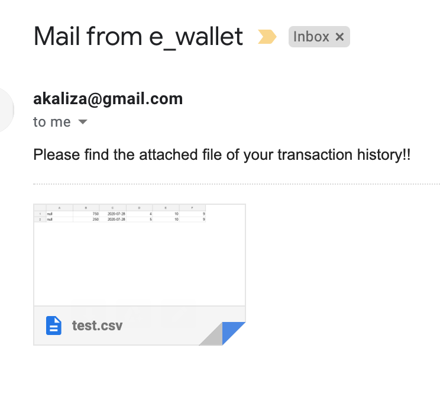

## Swagger

1. API exposed : http://localhost:8080/swagger-ui.html
2. APIs exposed : http://localhost:8090/swagger-ui.html

## Two services
1. userService
    - running on port 8080
2. walletService
    - running on port 8090

## DB user
`create database wallet;`
`create database user;`

## Redis
1. start a standalone redis server
$ `redis-server`
2. delete a key named user
`redis-cli del user`
3. get data for a given key
`HGETALL user`
4. check if a user with name jamo is in redis (return 1 if the user exists)
`HSET user name jamo`

## SMS

https://www.twilio.com/console
you need :
1. an account SID
2. an auth token
3. a phone from 
4. a phone to
5. a message

## Email
1. sending email gmail 

    - you must configure your Gmail account with the below steps:
    - In the security section:
    - You need to Change "Allow less secure apps: OFF" to "Allow less secure apps: ON"
        
        https://myaccount.google.com/lesssecureapps

#### Kafka

1. start ZooKeeper server
`bin/zookeeper-server-start.sh config/zookeeper.properties`

2. change #listeners=PLAINTEXT://:9092 in server.properties to:

`listeners=PLAINTEXT://localhost:9092`

3. start the Kafka server
`bin/kafka-server-start.sh config/server.properties`

4. list the topics 
`bin/kafka-topics.sh --list --bootstrap-server localhost:9092`

### PrintScreens 

    - email received 

    - sms received 
    

   

